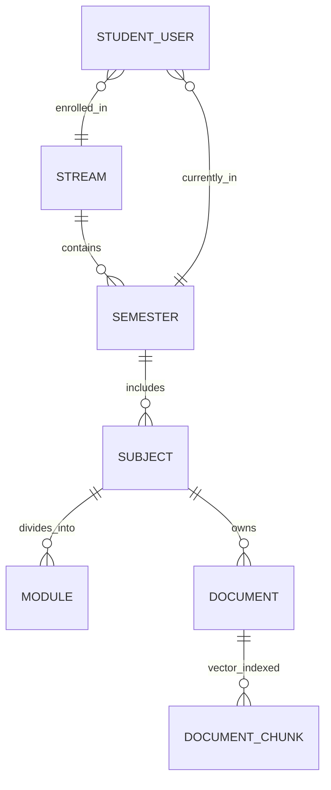
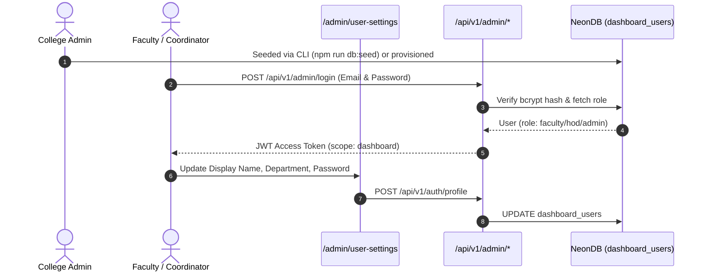
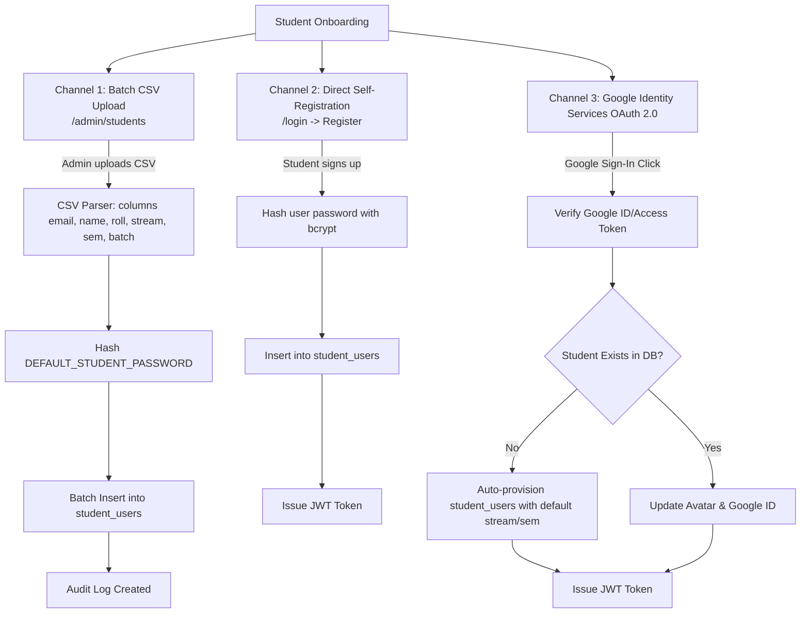
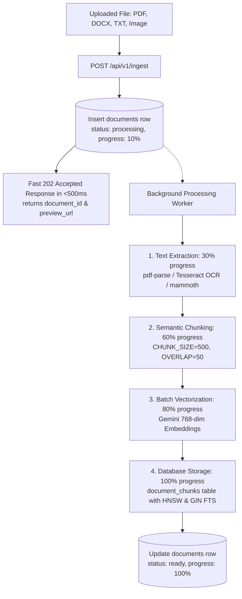
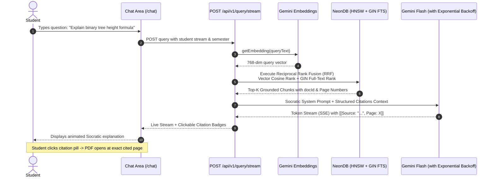
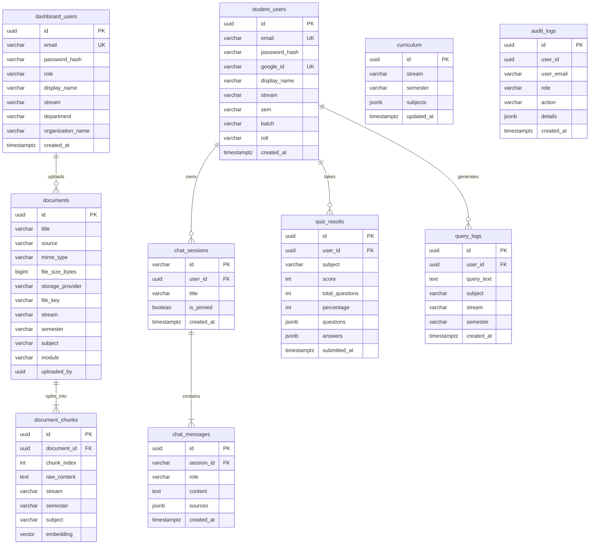

# Siksha Saathi — Comprehensive System Architecture & Operational Guide

This document provides a complete, in-depth architectural breakdown of **Siksha Saathi**, an AI-powered higher education academic tutoring and institutional intelligence platform.

---

## 1. High-Level System Architecture

Siksha Saathi is structured as a fullstack, single-repository Next.js application with unified API routes, serverless background workers, vector search capabilities via PostgreSQL `pgvector`, and cloud-native asset storage.

```mermaid
graph TD
    subgraph Client Layer
        SP[Student Portal Web UI<br>/chat, /resources, /exam]
        AP[Faculty & Admin Portal<br>/admin/*]
    end

    subgraph API & Middleware Layer [Next.js App Router API Routes /api/v1]
        AuthAPI[Auth & RBAC Service<br>JWT & Google OAuth 2.0]
        RAGAPI[Socratic Chat & Query Stream<br>SSE Streaming]
        IngestAPI[Ingestion & OCR Pipeline<br>Tesseract & Chunking]
        CurricAPI[Curriculum & Filter Manager]
        EnrollAPI[Student Enrollment Engine<br>CSV Parser]
        QuizAPI[Exam & Quiz Engine]
        AnalyticsAPI[Institutional Analytics]
    end

    subgraph Core Services Layer
        AuthSvc[Auth Service (jose, bcryptjs)]
        LLMSvc[Gemini LLM (Socratic System)]
        EmbedSvc[Gemini Embeddings (768-dim)]
        StorageSvc[Unified Cloud Storage<br>Cloudflare R2 / Dropbox]
        AuditSvc[Audit & Telemetry Logger]
    end

    subgraph Database Layer [NeonDB PostgreSQL]
        Drizzle[Drizzle ORM & pg client]
        Tables[(Relational Tables<br>users, sessions, curriculum)]
        VectorDB[(pgvector Vector Store<br>768-dim embeddings + HNSW)]
    end

    SP --> AuthAPI & RAGAPI & CurricAPI & QuizAPI
    AP --> AuthAPI & IngestAPI & CurricAPI & EnrollAPI & AnalyticsAPI
    
    AuthAPI --> AuthSvc
    RAGAPI --> LLMSvc & EmbedSvc & VectorDB
    IngestAPI --> StorageSvc & EmbedSvc & VectorDB & AuditSvc
    EnrollAPI --> AuthSvc & Tables & AuditSvc
    AnalyticsAPI --> Tables & AuditSvc

    AuthSvc & LLMSvc & EmbedSvc & StorageSvc & AuditSvc --> Drizzle --> Tables & VectorDB
```

---

## 2. User Personas, Roles & Access Control Matrix (RBAC)

The platform enforces a strict two-tier user ecosystem separated by authentication tokens and database tables:

1. **Dashboard Users (`dashboard_users` table)**: Faculty, HODs, Coordinators, and Administrators.
2. **Student Users (`student_users` table)**: Undergraduate and Postgraduate students.

### RBAC Permission Matrix

| Role | Target Table | Primary Responsibilities | Allowed Administrative Capabilities |
|---|---|---|---|
| `superuser` | `dashboard_users` | Platform owner / IT Director | Full system access, all streams, table management, curriculum configuration, student enrollment, raw database operations. |
| `admin` | `dashboard_users` | College Administrator | Batch student onboarding, curriculum authoring, institution-wide analytics, document management, audit log inspection. |
| `hod` | `dashboard_users` | Head of Department | Stream analytics for assigned department, student directory viewing, curriculum review, course document uploads. |
| `faculty` | `dashboard_users` | Course Instructor / Teacher | Course document uploads (PDF/DOCX/OCR), raw text ingestion, subject query analytics, knowledge base browsing. |
| `assistant` | `dashboard_users` | Teaching Assistant | Subject analysis, student query pattern inspection, document preview. |
| `student` | `student_users` | Enrolled Student | Socratic AI tutoring, course notes preview & download, adaptive MCQ exams, profile customization. |

### Secure Session Cookies & Next.js Edge Middleware
Authentication uses **`httpOnly` secure cookies** with Next.js Edge Middleware ([`src/middleware.ts`](file:///Users/monojitgoswami/projects/siksha-saathi/src/middleware.ts)) for zero-flash server-side route protection and complete immunity against client-side XSS token theft:

- **Student Session Cookie (`siksha_student_session`)**:
  - `httpOnly: true`, `sameSite: 'lax'`, `path: '/'`, `secure: production`.
  - Grants access to student routes (`/chat`, `/resources`, `/exam`) and curriculum materials scoped strictly to the student's registered `stream` and `semester`.
- **Admin Session Cookie (`siksha_admin_session`)**:
  - `httpOnly: true`, `sameSite: 'lax'`, `path: '/'`, `secure: production`.
  - Protects administrative routes (`/admin/*`) and enforces RBAC checks via `requireRole(user, allowedRoles)`.
- **Next.js Edge Middleware (`middleware.ts`)**:
  - Intercepts requests on the server before page rendering.
  - Automatically redirects unauthenticated requests on `/admin/*` to `/admin/login` and `/chat` to `/login` without client-side page flash or layout shift.
  - Redirects logged-in users away from auth pages to their respective dashboards.
- **Dual Session Support**: Separate cookie identifiers allow administrators and students to stay logged in concurrently across different browser tabs without collision.
- **API & Mobile Backward Compatibility**: `getAuthUser` inspects cookies first and gracefully falls back to `Authorization: Bearer <token>` headers for external API clients and testing.

---

## 3. Academic Hierarchy: Streams, Semesters, Subjects & Sections

The curriculum data model partitions institutional knowledge to ensure students receive AI tutoring strictly grounded in their specific syllabus.



### 1. Data Models
- **`curriculum` Table**:
  - `stream` (e.g., `'cse'`, `'it'`, `'ece'`, `'aiml'`, `'me'`)
  - `semester` (`'1'`, `'2'`, `'3'`, ..., `'8'`)
  - `subjects` (`JSONB` array of subject definitions: `[{"name": "Data Structures"}, {"name": "Algorithms"}]`)
- **`documents` Table**: Tagged by `stream`, `semester`, `subject`, `module`.
- **`document_chunks` Table**: Vector embeddings with metadata indexes on `(stream, semester, subject)`.

### 2. Adding New Streams, Courses & Subjects
There is no hardcoded limitation on streams or subjects. New academic departments and courses are dynamically registered in two ways:

#### A. Interactive Faculty UI (`/admin/manage-curriculum`)
1. Faculty/Admin selects or creates a **Stream** and **Semester**.
2. Adds subject titles (e.g., `"Deep Learning"`, `"VLSI Design"`).
3. Clicks **Save Syllabus Changes**, triggering `POST /api/v1/admin/curriculum`:
   ```sql
   INSERT INTO curriculum (stream, semester, subjects, updated_at, updated_by)
   VALUES ($1, $2, $3, NOW(), $4)
   ON CONFLICT (stream, semester)
   DO UPDATE SET subjects = EXCLUDED.subjects, updated_at = NOW(), updated_by = EXCLUDED.updated_by;
   ```

#### B. Dynamic Document Ingestion Inferred Registration
When a teacher uploads a document with a new stream or subject tag, the platform automatically indexes the document. The universal discovery endpoint (`GET /api/v1/filters`) performs a live union of:
- All explicit curriculum entries in `curriculum` table.
- All distinct streams and subjects present in the `documents` table.

This ensures zero configuration lag: newly ingested course tags appear immediately across all dropdowns.

### 3. Sections and Cohorts (Batches)
- Each student record includes a `batch` attribute (e.g. `'2024-2028'`) and department stream.
- Sections (e.g., `Section A`, `Section B`) can be assigned directly into the `batch` attribute during CSV batch enrollment or student registration without schema migrations.

---

## 4. Teacher, Faculty & Course Coordinator Management



### Provisioning Teachers & Coordinators
1. **Initial Admin Setup**: Seeded via `npm run db:seed` (reads `SEED_ADMIN_EMAIL` and `SEED_ADMIN_PASSWORD`).
2. **Assigning Department Coordinators (HODs)**: An admin creates or updates accounts in `dashboard_users` assigning `role: 'hod'` and `department: 'Computer Science'`.
3. **Faculty Self-Service**: Teachers log in via `/admin/login` and manage display names, associated streams, and security credentials in `/admin/user-settings`.
4. **Auditability**: Every administrative action (document upload, curriculum update, student enrollment) logs an immutable record in `audit_logs`.

---

## 5. Student Enrollment & Onboarding Pipeline

Siksha Saathi supports three onboarding channels:



### 1. High-Throughput Batch CSV Enrollment
- **Interface**: Admin navigates to `/admin/students` and pastes or uploads a student CSV roster.
- **Accepted CSV Headers**: `email`, `name`, `roll` (or `roll_no`), `stream`, `semester` (or `sem`), `batch`.
- **Default Password**: Automatically sets `process.env.DEFAULT_STUDENT_PASSWORD` (default: `student123`).
- **Duplicate Protection**: Existing emails are safely skipped and reported in the enrollment summary.

### 2. Self-Registration
- Students register with their college email and credentials via `POST /api/v1/student/register`.
- Profile fields (`stream`, `sem`, `roll`, `batch`) fall back to configured environment defaults (`DEFAULT_STUDENT_STREAM`, `DEFAULT_STUDENT_SEM`, `DEFAULT_STUDENT_BATCH`) if omitted.

### 3. Google OAuth 2.0 Automatic Provisioning
- Uses Google Identity Services (GSI) with OAuth 2.0 token verification.
- When a student logs in with Google for the first time, a corresponding `student_users` row is automatically created, capturing Google avatar, verified email, and full name.

---

## 6. Asynchronous Document Ingestion, OCR & Hybrid Knowledge Base



1. **Non-Blocking Ingestion**: Uploads return `202 Accepted` immediately, eliminating HTTP gateway timeouts on large textbooks.
2. **Format Handling & OCR Fallback**:
   - **PDF**: Direct text extraction using `pdf-parse`. If text density is low (< 50 characters), automatically invokes **Tesseract.js OCR**.
   - **DOCX**: Extracted using `mammoth`.
   - **Images**: Direct OCR processing via Tesseract.
3. **Chunking Engine**: Splits extracted text into semantic chunks with sliding overlap window to preserve inter-sentence context.
4. **Embeddings & Storage**: Original files saved in Cloudflare R2 ($0 egress S3) / Dropbox. Vectors stored in `document_chunks` with **PostgreSQL HNSW** vector cosine index and **PostgreSQL GIN full-text index**.

---

## 7. Socratic AI Tutor & Hybrid Search RAG (Vector + Full-Text RRF)



### Hybrid Search Formula: Reciprocal Rank Fusion (RRF)
Retrieval combines semantic vector distance with lexical keyword matching:
$$\text{RRF Score} = \frac{1}{60 + \text{Vector Rank}} + \frac{1}{60 + \text{Text Search Rank}}$$

### Interactive Page-Level Citations
1. **Curriculum-Grounded**: The AI strictly answers using course reference material provided in context.
2. **Structured Citation Syntax**: Gemini is instructed to emit citation anchors: `[[Source: "Unit 1.pdf", Page: 14, docId: "uuid"]]`.
3. **Click-to-Page PDF Viewer**: The student chat UI parses these tags into interactive buttons. Clicking opens [`FilePreview`](file:///Users/monojitgoswami/projects/siksha-saathi/src/components/student/FilePreview.tsx) scrolled directly to the cited page.

---

## 8. Automated Examination & Assessment Engine

- **Endpoint**: `POST /api/v1/quiz/generate`
- **Mechanism**: Extracts relevant chunks for a subject/module and instructs Gemini in structured JSON schema mode to generate 5-10 multiple-choice questions (MCQs) with options, correct answer keys, and pedagogical explanations.
- **Evaluation & Telemetry**: Students submit quizzes at `POST /api/v1/quiz/submit`. The server computes scores, logs completion time, and stores answers in `quiz_results`.

---

## 9. Institutional Analytics & Academic Risk Tracking

Faculty and administrators have access to dedicated telemetry dashboards:
1. **Query Analytics (`/admin/query-analytics`)**: Real-time stream of student academic questions, identifying trending topics and areas of high confusion.
2. **Stream & Semester Analysis (`/admin/stream-analytics`)**: Department-level query volume and engagement metrics.
3. **Subject Risk Analysis (`/admin/subject-analysis`)**: Evaluates query density against specific modules to identify subjects where students struggle most.
4. **Audit Logs (`audit_logs`)**: Comprehensive tracking of all administrative modifications, curriculum updates, and document deletions.

---

## 10. Complete Database ER Diagram & CLI Commands



### Quick Database CLI Reference
- `npm run db:setup` ➔ Initialize tables, seed admin/curriculum, and validate.
- `npm run db:seed` ➔ Re-seed administrator and curriculum.
- `npm run db:validate` ➔ Check connection latency, table record counts, and indexes.
- `npm run db:clear` ➔ Truncate all records across all tables.
- `npm run db:reset` ➔ Drop all tables and recreate schema.
- `npm run db:studio` ➔ Open visual Drizzle Studio web GUI.
