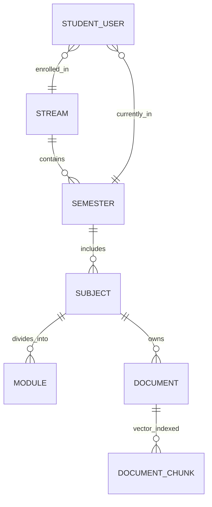
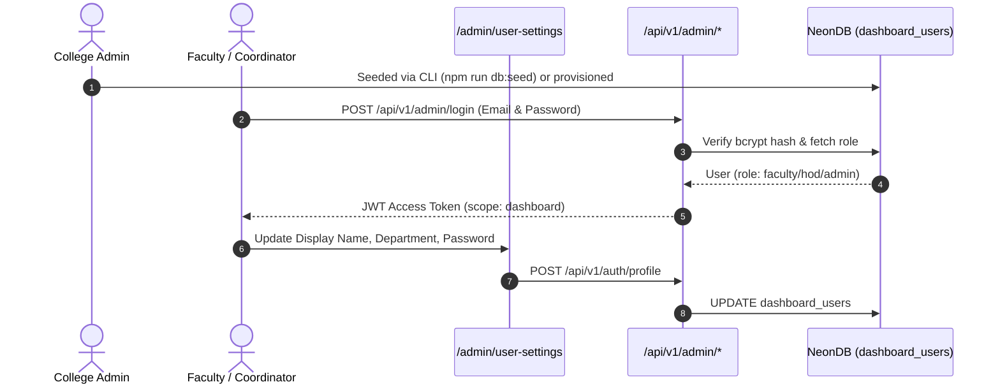
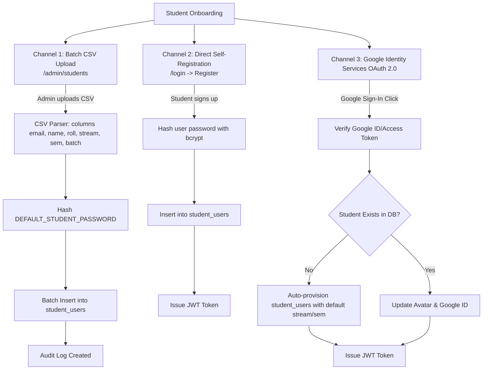
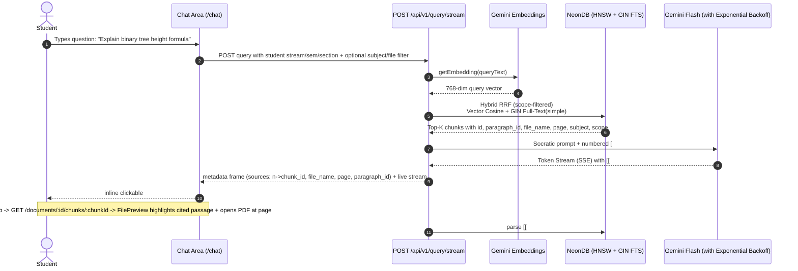
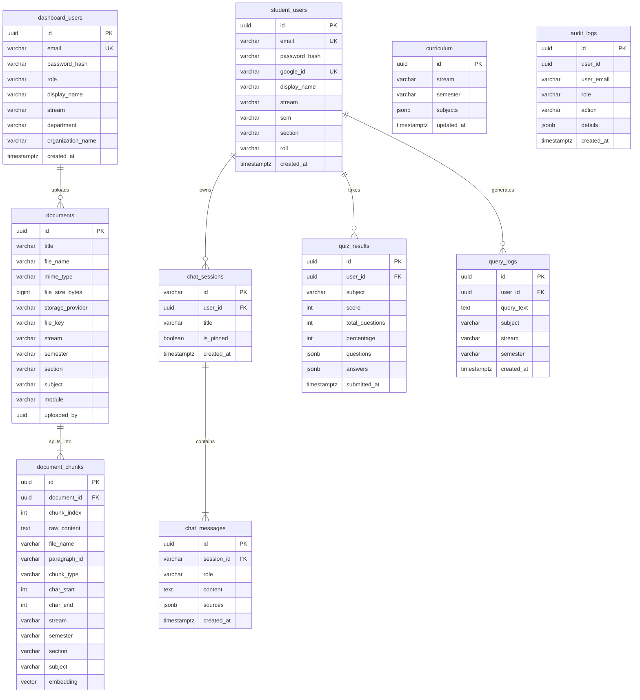

# Siksha Saathi — Comprehensive System Architecture & Operational Guide

This document provides a complete, in-depth architectural breakdown of **Siksha Saathi**, an AI-powered higher education academic tutoring and institutional intelligence platform.

---

## 1. High-Level System Architecture

Siksha Saathi is structured as a fullstack, single-repository Next.js application with unified API routes, serverless background workers, vector search capabilities via PostgreSQL `pgvector`, and cloud-native asset storage.

```mermaid
graph TD
    subgraph Client Layer
        SP[Student Portal Web UI<br>/chat, /resources, /exam]
        AP[Faculty & Admin Portal<br>/admin/*]
    end

    subgraph API & Middleware Layer [Next.js App Router API Routes /api/v1]
        AuthAPI[Auth & RBAC Service<br>JWT & Google OAuth 2.0]
        RAGAPI[Socratic Chat & Query Stream<br>SSE Streaming]
        IngestAPI[Ingestion & OCR Pipeline<br>Tesseract & Chunking]
        CurricAPI[Curriculum & Filter Manager]
        EnrollAPI[Student Enrollment Engine<br>CSV Parser]
        QuizAPI[Exam & Quiz Engine]
        AnalyticsAPI[Institutional Analytics]
    end

    subgraph Core Services Layer
        AuthSvc[Auth Service (jose, bcryptjs)]
        LLMSvc[Gemini LLM (Socratic System)]
        EmbedSvc[Gemini Embeddings (768-dim)]
        StorageSvc[Unified Cloud Storage<br>Cloudflare R2 / Dropbox]
        AuditSvc[Audit & Telemetry Logger]
    end

    subgraph Database Layer [NeonDB PostgreSQL]
        Drizzle[Drizzle ORM & pg client]
        Tables[(Relational Tables<br>users, sessions, curriculum)]
        VectorDB[(pgvector Vector Store<br>768-dim embeddings + HNSW)]
    end

    SP --> AuthAPI & RAGAPI & CurricAPI & QuizAPI
    AP --> AuthAPI & IngestAPI & CurricAPI & EnrollAPI & AnalyticsAPI
    
    AuthAPI --> AuthSvc
    RAGAPI --> LLMSvc & EmbedSvc & VectorDB
    IngestAPI --> StorageSvc & EmbedSvc & VectorDB & AuditSvc
    EnrollAPI --> AuthSvc & Tables & AuditSvc
    AnalyticsAPI --> Tables & AuditSvc

    AuthSvc & LLMSvc & EmbedSvc & StorageSvc & AuditSvc --> Drizzle --> Tables & VectorDB
```

---

## 2. User Personas, Roles & Access Control Matrix (RBAC)

The platform enforces a strict two-tier user ecosystem separated by authentication tokens and database tables:

1. **Dashboard Users (`dashboard_users` table)**: Admin, HOD, and Faculty.
2. **Student Users (`student_users` table)**: Undergraduate and Postgraduate students.

### RBAC Permission Matrix

| Role | Target Table | Primary Responsibilities | Allowed Capabilities |
|---|---|---|---|
| `admin` | `dashboard_users` | College Administrator | Full system access: manage faculty (create/update/delete/reset-password), curriculum, student enrollment, document management, all analytics across all streams. |
| `hod` | `dashboard_users` | Head of Department | Scoped to their **stream**: analytics + heatmaps, faculty performance (subjects/sems/sections each faculty teaches), student directory for their stream, uploads forced to their stream. Cannot see other streams. |
| `faculty` | `dashboard_users` | Course Instructor | Uploads (forced to their stream); sees analytics only for materials **they uploaded**. Cannot access the student directory. |
| `student` | `student_users` | Enrolled Student | Socratic tutoring, notes, exams. Retrieves only chunks matching `stream` + `semester` + `section` (per-dimension `General` wildcard). |

> `superuser` and `assistant` removed (single-tenant). `admin` is the top role — `requireRole` grants access if the role is in the allow-list or is `admin`.
> HOD/faculty `stream` is resolved from `dashboard_users` at request time (JWT carries no stream). `document_id` filters are AND-ed with scope (never bypass). Non-admins cannot self-reassign stream.

### Secure Session Cookies & Next.js Proxy
Authentication uses **`httpOnly` secure cookies** with Next.js Proxy ([`src/proxy.ts`](file:///Users/monojitgoswami/projects/siksha-saathi/src/proxy.ts)) for zero-flash server-side route protection and complete immunity against client-side XSS token theft:

- **Student Session Cookie (`siksha_student_session`)**:
  - `httpOnly: true`, `sameSite: 'lax'`, `path: '/'`, `secure: production`.
  - Grants access to student routes (`/chat`, `/resources`, `/exam`) and curriculum materials scoped strictly to the student's registered `stream` and `semester`.
- **Admin Session Cookie (`siksha_admin_session`)**:
  - `httpOnly: true`, `sameSite: 'lax'`, `path: '/'`, `secure: production`.
  - Protects administrative routes (`/admin/*`) and enforces RBAC checks via `requireRole(user, allowedRoles)`.
- **Next.js Proxy (`proxy.ts`)**:
  - Intercepts requests on the server before page rendering.
  - Automatically redirects unauthenticated requests on `/admin/*` to `/admin/login` and `/chat` to `/login` without client-side page flash or layout shift.
  - Redirects logged-in users away from auth pages to their respective dashboards.
- **Dual Session Support**: Separate cookie identifiers allow administrators and students to stay logged in concurrently across different browser tabs without collision.
- **API & Mobile Backward Compatibility**: `getAuthUser` inspects cookies first and gracefully falls back to `Authorization: Bearer <token>` headers for external API clients and testing.

---

## 3. Academic Hierarchy: Streams, Semesters, Subjects & Sections

The curriculum data model partitions institutional knowledge to ensure students receive AI tutoring strictly grounded in their specific syllabus.



### 1. Data Models
- **`curriculum` Table**:
  - `stream` (e.g., `'cse'`, `'it'`, `'ece'`, `'aiml'`, `'me'`)
  - `semester` (`'1'`, `'2'`, `'3'`, ..., `'8'`)
  - `subjects` (`JSONB` array of subject definitions: `[{"name": "Data Structures"}, {"name": "Algorithms"}]`)
- **`documents` Table**: Tagged by `stream`, `semester`, `subject`, `module`.
- **`document_chunks` Table**: Vector embeddings with metadata indexes on `(stream, semester, subject)`.

### 2. Adding New Streams, Courses & Subjects
There is no hardcoded limitation on streams or subjects. New academic departments and courses are dynamically registered in two ways:

#### A. Interactive Faculty UI (`/admin/manage-curriculum`)
1. Faculty/Admin selects or creates a **Stream** and **Semester**.
2. Adds subject titles (e.g., `"Deep Learning"`, `"VLSI Design"`).
3. Clicks **Save Syllabus Changes**, triggering `POST /api/v1/admin/curriculum`:
   ```sql
   INSERT INTO curriculum (stream, semester, subjects, updated_at, updated_by)
   VALUES ($1, $2, $3, NOW(), $4)
   ON CONFLICT (stream, semester)
   DO UPDATE SET subjects = EXCLUDED.subjects, updated_at = NOW(), updated_by = EXCLUDED.updated_by;
   ```

#### B. Dynamic Document Ingestion Inferred Registration
When a teacher uploads a document with a new stream or subject tag, the platform automatically indexes the document. The universal discovery endpoint (`GET /api/v1/filters`) performs a live union of:
- All explicit curriculum entries in `curriculum` table.
- All distinct streams and subjects present in the `documents` table.

This ensures zero configuration lag: newly ingested course tags appear immediately across all dropdowns.

### 3. Sections
- Each student record includes a **`section`** column (e.g. `'cse1'`, `'cse2'`, `'ece1'`) — the class grouping within a stream.
- Documents and chunks carry `section` too, so a material can be scoped to a specific section or marked `General` (available to all sections in that stream/semester).
- Retrieval enforces all four dimensions independently — `General` on one dimension is a wildcard for that dimension only (e.g. `semester=1, stream=General, section=General` → visible to all stream/section students in semester 1).

---

## 4. Teacher, Faculty & Course Coordinator Management



### Provisioning Teachers & Coordinators
1. **Initial Admin Setup**: Seeded via `npm run db:seed` (reads `SEED_ADMIN_EMAIL` and `SEED_ADMIN_PASSWORD`).
2. **Assigning Department Coordinators (HODs)**: An admin creates or updates accounts in `dashboard_users` assigning `role: 'hod'` and `department: 'Computer Science'`.
3. **Faculty Self-Service**: Teachers log in via `/admin/login` and manage display names, associated streams, and security credentials in `/admin/user-settings`.
4. **Auditability**: Every administrative action (document upload, curriculum update, student enrollment) logs an immutable record in `audit_logs`.

---

## 5. Student Enrollment & Onboarding Pipeline

Siksha Saathi supports three onboarding channels:



### 1. High-Throughput Batch CSV Enrollment
- **Interface**: Admin navigates to `/admin/students` and pastes or uploads a student CSV roster.
- **Accepted CSV Headers**: `email`, `name`, `roll` (or `roll_no`), `stream`, `semester` (or `sem`), `batch`.
- **Default Password**: Automatically sets `process.env.DEFAULT_STUDENT_PASSWORD` (default: `student123`).
- **Duplicate Protection**: Existing emails are safely skipped and reported in the enrollment summary.

### 2. Self-Registration
- Students register with their college email and credentials via `POST /api/v1/student/register`.
- Profile fields (`stream`, `sem`, `roll`, `batch`) fall back to configured environment defaults (`DEFAULT_STUDENT_STREAM`, `DEFAULT_STUDENT_SEM`, `DEFAULT_STUDENT_BATCH`) if omitted.

### 3. Google OAuth 2.0 Automatic Provisioning
- Uses Google Identity Services (GSI) with OAuth 2.0 token verification.
- When a student logs in with Google for the first time, a corresponding `student_users` row is automatically created, capturing Google avatar, verified email, and full name.

---

## 6. Asynchronous Document Ingestion, OCR & Hybrid Knowledge Base

The ingestion pipeline runs in a **separate long-running service** (`/ingestion-worker`, deployed e.g. on Render) — not in the serverless web app. This removes all timeout pressure (OCR + embeddings can take minutes for large/scanned docs).

```mermaid
flowchart TD
    File[Uploaded File: PDF, DOCX, PPTX, MD, Image] --> Ingest[POST /api/v1/ingest]
    Ingest --> Upload[Upload original to R2/Dropbox]
    Upload --> InitDB[(Insert documents row<br>status: processing, progress: 10%)]
    InitDB --> Enqueue[(Insert ingestion_jobs row<br>status: pending)]
    Enqueue --> FastResp[Fast 202 Accepted Response<br>returns document_id & preview_url]
    
    Enqueue -.-> Worker[ ingestion-worker polls ingestion_jobs<br>FOR UPDATE SKIP LOCKED ]
    Worker --> Download[Download file from storage by file_key]
    Download --> Step1[1. Text Extraction: 30%<br>pdfjs-dist per-page text]
    Step1 --> OcrDetect{per-page text<br>density < 20 chars?}
    OcrDetect -- yes --> Render[Render page to PNG<br>@napi-rs/canvas] --> OCR[Tesseract.js OCR<br>singleton worker, multilingual]
    OcrDetect -- no --> Step2
    OCR --> Step2[2. Paragraph-aware Chunking: 60%<br>paragraph_id, char_start/end, chunk_type]
    Step2 --> Step3[3. Batch Embeddings: 80%<br>Gemini batchEmbedContents <=100/call]
    Step3 --> Step4[4. Batch Insert: 100%<br>document_chunks HNSW + GIN(simple/multilingual)]
    Step4 --> Step5[(documents status: ready<br>job status: done)]
```

1. **Non-Blocking**: the web app only authenticates, scopes (non-admin forced to their stream), uploads, inserts the document row + an `ingestion_jobs` row, and returns `202`. No heavy work in the serverless function.
2. **Worker** polls `ingestion_jobs` (`FOR UPDATE SKIP LOCKED`), claims a job, downloads the file from storage, and runs the pipeline. Failed jobs are requeued up to `max_attempts` (default 3).
3. **Format Handling & per-page OCR detection**:
   - **PDF**: `pdfjs-dist` per-page `getTextContent` (accurate page tracking). For each page with < `OCR_MIN_TEXT_CHARS`, render the page to PNG (`@napi-rs/canvas`) and OCR it (Tesseract) — so scanned/image-only pages become searchable text. `OCR_MAX_PAGES` caps rendering for huge scanned books.
   - **DOCX**: `mammoth`. **PPTX**: `officeparser`. **MD**: front-matter stripped. **Images**: direct OCR. **TXT/CSV**: utf-8.
4. **Multilingual**: OCR defaults to `eng+hin` (`TESSERACT_LANGS`); full-text search uses `to_tsvector('simple', …)` (language-agnostic); Gemini embeddings/LLM are natively multilingual.
5. **Chunking**: paragraph-aware — each chunk carries `paragraph_id` (`page:para`), `chunk_type` (`text`/`image`/`table`), `char_start`/`char_end`, `file_name`, and scope metadata.
6. **Embeddings**: `batchEmbedContents` (≤100 texts per Gemini call) instead of N single calls — ~10× faster. Stored with HNSW cosine index + GIN FTS (`simple`).
7. **Speedups**: singleton Tesseract worker (reused across pages/jobs); batch chunk inserts (groups of 100).

---

## 7. Socratic AI Tutor & Hybrid Search RAG (Vector + Full-Text RRF)



### Hybrid Search Formula: Reciprocal Rank Fusion (RRF)
Retrieval combines semantic vector distance with lexical keyword matching (multilingual via `simple` tsvector):
$$\text{RRF Score} = \frac{1}{60 + \text{Vector Rank}} + \frac{1}{60 + \text{Text Search Rank}}$$

### Chunk-level Citations & Counters
1. **Curriculum-Grounded**: the AI strictly answers using the scoped course material in context.
2. **Ordinal citations**: each context block is labeled `[#n]`; Gemini emits `[[#n]]`. The backend deterministically maps ordinals → real `chunk_id`/metadata from the `sources` payload (the LLM never sees raw UUIDs — hallucination-proof).
3. **Click-to-chunk**: inline `#n` chips fetch `GET /api/v1/documents/:id/chunks/:chunkId` (scope-checked) → `FilePreview` shows a **highlighted cited-passage panel** (text + page + paragraph + OCR badge) and deep-links the PDF page.
4. **Per-material/per-subject heatmaps**: after the stream, `[[#n]]` ordinals are parsed and a `query_citations` row is inserted for **every** cited chunk (material1 + material2 both increment). Dashboards aggregate `COUNT(DISTINCT query_log_id)` per subject/document — a query citing two subjects increments both.

---

## 8. Automated Examination & Assessment Engine

- **Endpoint**: `POST /api/v1/quiz/generate`
- **Mechanism**: Extracts relevant chunks for a subject/module and instructs Gemini in structured JSON schema mode to generate 5-10 multiple-choice questions (MCQs) with options, correct answer keys, and pedagogical explanations.
- **Evaluation & Telemetry**: Students submit quizzes at `POST /api/v1/quiz/submit`. The server computes scores, logs completion time, and stores answers in `quiz_results`.

---

## 9. Institutional Analytics & Academic Risk Tracking

Faculty and administrators have access to dedicated telemetry dashboards:
1. **Query Analytics (`/admin/query-analytics`)**: Real-time stream of student academic questions, identifying trending topics and areas of high confusion.
2. **Stream & Semester Analysis (`/admin/stream-analytics`)**: Department-level query volume and engagement metrics.
3. **Subject Risk Analysis (`/admin/subject-analysis`)**: Evaluates query density against specific modules to identify subjects where students struggle most.
4. **Audit Logs (`audit_logs`)**: Comprehensive tracking of all administrative modifications, curriculum updates, and document deletions.

---

## 10. Complete Database ER Diagram & CLI Commands



### Quick Database CLI Reference
- `npm run db:setup` ➔ Initialize tables, seed admin/curriculum, and validate.
- `npm run db:seed` ➔ Re-seed administrator and curriculum.
- `npm run db:validate` ➔ Check connection latency, table record counts, and indexes.
- `npm run db:clear` ➔ Truncate all records across all tables.
- `npm run db:reset` ➔ Drop all tables and recreate schema.
- `npm run db:studio` ➔ Open visual Drizzle Studio web GUI.
