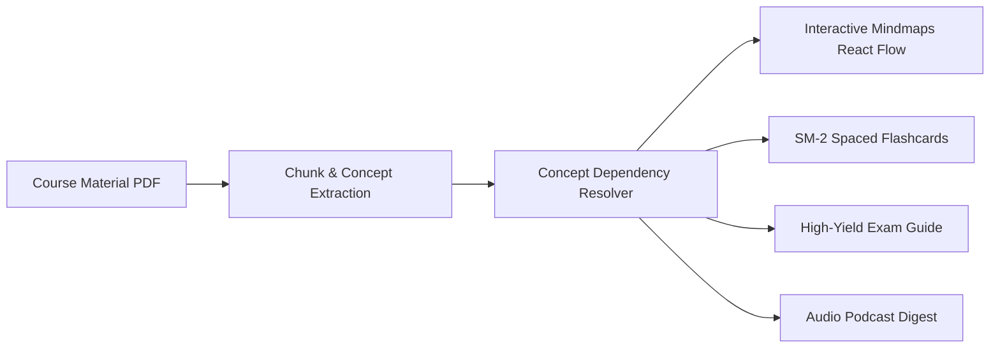
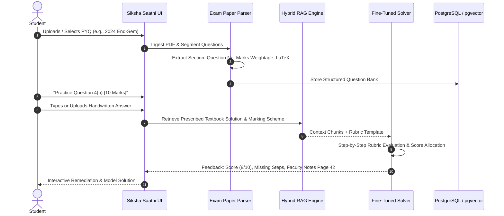
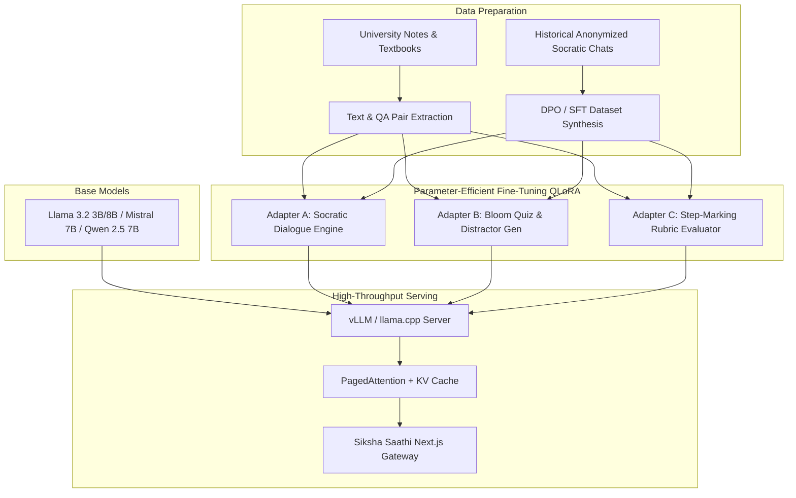
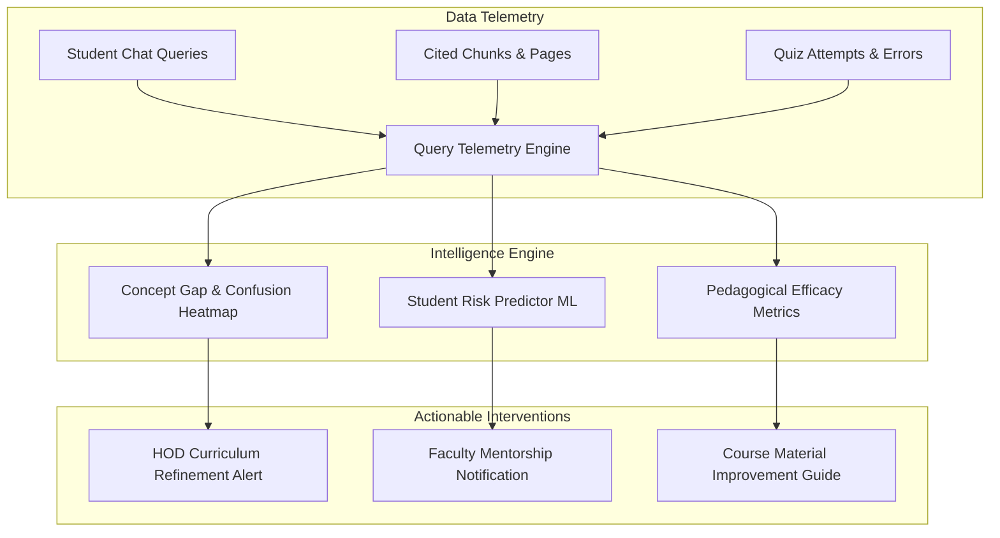
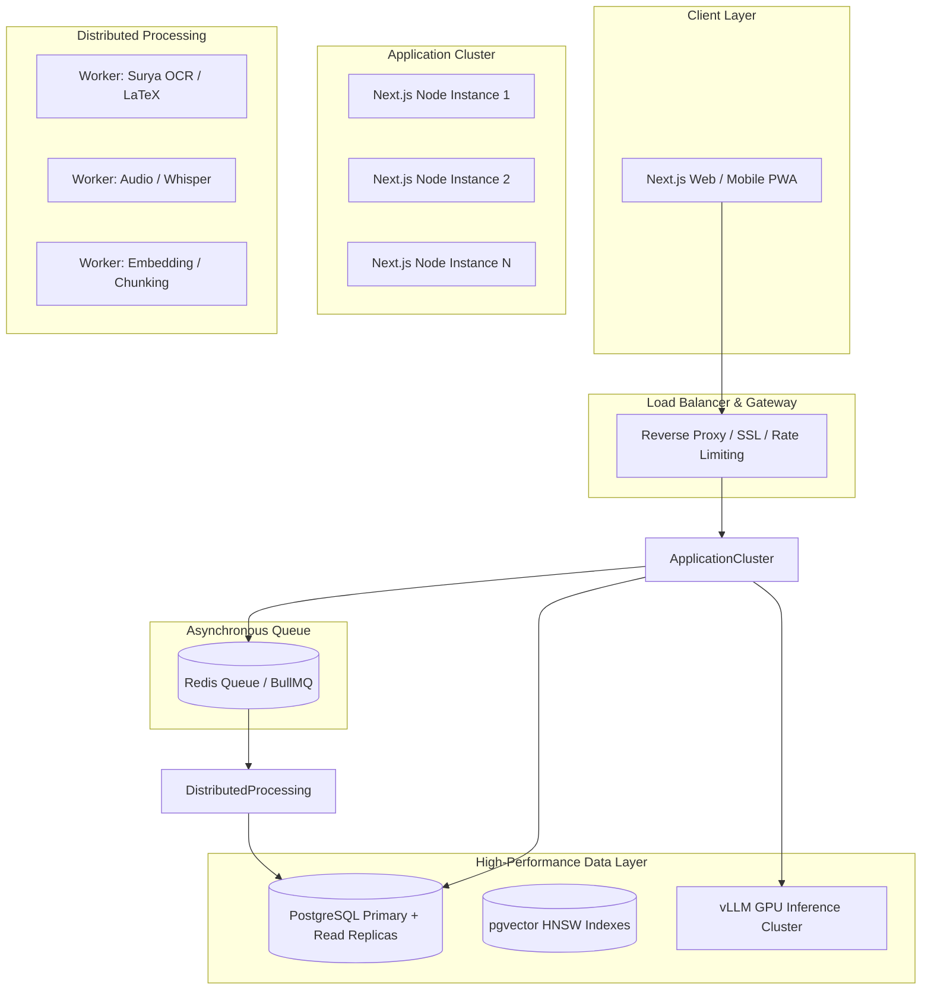
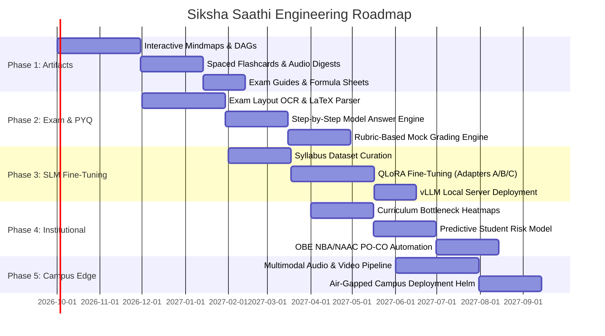

# Siksha Saathi — Strategic Architecture & Technology Roadmap

> **Autonomous, Curriculum-Grounded Academic Intelligence, Local SLM Specialization, Generative Study Artifacts, and Institutional Analytics for Higher Education.**

---

## Executive Overview & Strategic Vision

**Siksha Saathi** is designed to solve the foundational challenge of modern higher education: providing every student with an individualized, 24/7 Socratic academic tutor while simultaneously equipping institutions, Department Heads (HODs), and faculty with real-time empirical visibility into student learning patterns, concept bottlenecks, and pedagogical efficacy.

Unlike generic consumer AI wrappers, Siksha Saathi operates with **deterministic institutional scoping**, **strict syllabus grounding**, and **hybrid lexical + semantic retrieval** over verified course materials. 

This document outlines the **multi-phase engineering and research roadmap** for Siksha Saathi, detailing the transition from a retrieval-augmented question-answering system into a self-hosted, domain-specialized academic ecosystem featuring:
- **Interactive Generative Study Artifacts** (dynamic mindmaps, micro-recaps, and exam guides)
- **Autonomous Question Paper Solving & Mock Grading Engines**
- **Domain-Specific Small Language Model (SLM) Fine-Tuning** with LoRA adapters for pedagogical dialogue and assessment generation
- **Predictive Academic Intelligence & Accreditation (OBE) Analytics** for institutional leadership
- **Air-Gapped, On-Campus Edge Deployment** eliminating recurring cloud API costs and guaranteeing absolute student data sovereignty.

---

```mermaid
graph TD
    subgraph Phase 1: Generative Study Artifacts
        A1[Dynamic Concept Mindmaps] --> A2[Interactive Visual DAGs]
        A3[Pre/Post Lecture Micro-Recaps] --> A4[Spaced Repetition Flashcards]
        A5[High-Yield Exam Guides] --> A6[Auto Formula & Algorithm Sheets]
    end

    subgraph Phase 2: Autonomous Exam Engine
        B1[University PYQ Ingestion] --> B2[LaTeX & Formula Layout Parser]
        B2 --> B3[Step-by-Step Model Answer Engine]
        B4[Student Mock Submission] --> B5[Rubric-Based Automated Evaluator]
    end

    subgraph Phase 3: Self-Hosted SLM Fine-Tuning
        C1[Curated University Curricula Datasets] --> C2[LoRA Adapter: Socratic Tutor]
        C1 --> C3[LoRA Adapter: Bloom Quiz Gen]
        C1 --> C4[LoRA Adapter: Step Evaluator]
        C2 & C3 & C4 --> C5[vLLM / llama.cpp On-Prem Inference]
    end

    subgraph Phase 4: Institutional Intelligence
        D1[Query Citation Telemetry] --> D2[Concept Gap & Confusion Heatmaps]
        D3[Quiz Attempt Velocity] --> D4[Predictive Academic Intervention]
        D5[Outcome-Based Education OBE] --> D6[Automated NBA/NAAC PO-CO Mapping]
    end

    Phase 1 --> Phase 2
    Phase 2 --> Phase 3
    Phase 3 --> Phase 4
```

---

## Current Baseline: v2.0 Architecture Summary

As of version 2.0, Siksha Saathi provides:
1. **Three-Process Microservice Topology**:
   - **Next.js 16 Web Core** (App Router, Server Actions, Server-Sent Events streaming, Drizzle ORM).
   - **FastAPI Embedding Service** (`intfloat/multilingual-e5-small` 384-dim dense vectors with LRU vector caching + `cross-encoder/ms-marco-MiniLM-L-6-v2` reranker).
   - **Optimized Python Ingestion Worker** (PyMuPDF C-bindings, Tesseract OCR for dual English/Hindi, sliding-window chunking).
2. **Deterministic Role & Academic Scoping**:
   - Quad-dimensional isolation: `Stream` × `Semester` × `Section` × `Subject` with hierarchical wildcards (`General`).
   - Role-based views: `Admin`, `HOD`, `Faculty`, and pre-enrolled `Student`.
3. **Local Dockerized Volume Storage**:
   - Self-contained `.storage/course_materials/` directory eliminating third-party cloud storage dependencies.
   - Streaming PDF endpoints with byte-range support and native in-browser viewing.
4. **Adaptive MCQ Generation & Real-Time Tracking**:
   - Persistent PostgreSQL quizzes with `available`, `incomplete`, and `completed` lifecycle tracking.
   - Socratic LLM streaming with diagonal inline citations and direct end-of-message source chips.

---

## 1. Generative Study Artifacts & Active Learning Engine

While chat-based tutoring provides immediate doubt clarification, students retain information significantly better when synthesizing knowledge through structured visual, chronological, and summarized representations. This pillar introduces automated, syllabus-grounded artifact generation.



### 1.1 Dynamic Knowledge Graphs & Interactive Mindmaps
Rather than linear reading, complex engineering and science topics require non-linear conceptual linking (e.g., how *Lexical Analysis* relates to *Finite Automata*, *Symbol Tables*, and *Grammar Parsing*).

- **Automated Entity & Relation Extraction**:
  - Ingestion worker extracts core entities (theorems, definitions, algorithms, hardware architectures) and directed relationships (`is-a`, `depends-on`, `implements`, `contrasts-with`).
  - Output formatted as a JSON Graph Specification (`nodes`, `edges`, `cluster_ids`, `source_page_references`).
- **Interactive Canvas UI**:
  - Rendered using **React Flow** and **D3.js** with zoom, pan, sub-tree collapsing, and hierarchical layouts (Sugiyama / DAG algorithms).
  - **Click-to-Learn Node Interaction**: Clicking any concept node triggers a side-drawer displaying:
    1. Concise 2-sentence formal definition.
    2. Interactive Socratic prompt ("Ask tutor to explain this link").
    3. Direct citation deep-link to the exact textbook/slide page.
- **Color-Coded Learning Mastery Overlay**:
  - Mindmap nodes dynamically reflect student proficiency derived from quiz outcomes:
    - 🟢 *Mastered* (Accurate quiz performance on chunks mapped to this concept).
    - 🟡 *Partially Understood* (Reviewed in notes, but answered incorrectly in recent quizzes).
    - 🔴 *High Doubt / Unexplored* (Frequent queries or unattempted questions).

### 1.2 Micro-Recaps & Adaptive Spaced-Repetition Flashcards
- **Pre-Lecture "5-Minute Primer"**:
  - Generated 12 hours before scheduled lectures based on faculty syllabus progress.
  - Summarizes foundational prerequisites ("Before attending *B-Trees*, quickly review *Binary Search Trees* and *Disk I/O latency*").
- **Post-Lecture Concept Digest**:
  - Bulleted synthesis of today's key takeaways, core equations, and standard exam question patterns.
- **Anki-Compatible Spaced Repetition Flashcards (SuperMemo SM-2 Algorithm)**:
  - Generates atomic Q&A cards with difficulty ratings (`Easy`, `Good`, `Hard`, `Again`).
  - Implements the SM-2 spaced repetition formula:
    $$EF' = EF + (0.1 - (5 - q) \times (0.08 + (5 - q) \times 0.02))$$
    where $EF$ is the Easiness Factor and $q$ is the student's self-assessed response quality ($0-5$).
  - Web and mobile review interface with export to `.apkg` (native Anki format).
- **Audio Podcast / Micro-Lecture Generation**:
  - Synthesis of 3-to-5 minute conversational audio recaps using lightweight local neural Text-to-Speech (TTS) models (e.g., Piper, Coqui TTS, or Edge-TTS).
  - Designed for commute and audio revision.

### 1.3 High-Yield Exam Guides & Quick-Reference Cheat Sheets
- **Automated Formula & Theorem Sheets**:
  - Regex and AST extraction of mathematical equations, units, standard assumptions, and variable definitions formatted into clean, printable LaTeX / KaTeX summaries.
- **Algorithm & Code Quick-Reference**:
  - Time/space complexity tables, invariant proofs, and idiomatic pseudocode extracted directly from course textbooks.
- **"Must-Know vs. Good-to-Know" Priority Tiers**:
  - Classifies concepts into:
    - **Tier 1 (Core Passing Criteria)**: Foundational definitions and high-probability derivations appearing frequently in institutional exams.
    - **Tier 2 (Scoring / Distinction)**: Edge cases, complex proofs, and higher-order synthesis problems.

---

## 2. Autonomous Question Paper Solving & Mock Evaluation Engine (PYQ Engine)

Institutional exams frequently adhere to past patterns. The Previous Year Questions (PYQ) engine automates the ingestion, parsing, solving, and automated evaluation of historical university question papers.



### 2.1 University Exam Paper Ingestion & Document Layout Parsing
- **Hybrid OCR & Vision-Based Layout Analysis**:
  - Uses specialized layout detection models (e.g., **Surya OCR** or **LayoutLMv3**) to segment complex exam paper formats:
    - University header & course codes (`CS501`, `EC402`).
    - Section groupings (`Section A: 10 × 2 Marks`, `Section B: 5 × 10 Marks`).
    - Compulsory vs. optional choices ("Answer any 5 out of 8 questions").
    - Sub-part hierarchies (`Q3. (a) [4 marks]`, `Q3. (b) [6 marks]`).
- **Mathematical Formula & Diagram Preservation**:
  - Ingestion of printed and handwritten mathematical equations into clean LaTeX strings (`$$\int_{0}^{\infty} e^{-x^2} dx$$`).
  - Cropping and embedding of accompanying circuit diagrams, logic gates, and schematic figures.

### 2.2 Model Answer Generation Aligned with Institutional Mark Schemes
- **Step-Mark Rubric Synthesis**:
  - For a 10-mark question, the engine breaks down the solution into standardized grading milestones:
    - *Definition & Principle* (2 marks)
    - *Derivation / Architectural Block Diagram* (4 marks)
    - *Worked Mathematical Example / Code Implementation* (3 marks)
    - *Concluding Analysis / Applications* (1 mark)
- **Verified Textbook & Faculty Notes Citations**:
  - Every step of the model solution is linked directly to the institution's uploaded course documents (e.g., *"Step 2 corresponds to Chapter 4, Theorem 4.2 in prescribed textbook"*).
- **"Common Pitfalls & Mistakes to Avoid" Callouts**:
  - Identifies frequent student errors (e.g., forgetting base cases in recursion, sign errors in integration, omitting unit dimensions).

### 2.3 Student Answer Evaluation & Mock Grading Assistant
- **Dual Submission Modes**:
  - **Typed Input**: Markdown editor with real-time KaTeX math formatting and code syntax highlighting.
  - **Handwritten Paper Upload**: Camera capture / scan of student's physical answer sheet processed via high-accuracy handwriting OCR.
- **Automated Rubric-Based Mock Grading**:
  - Evaluates student response against the generated marking rubric.
  - Awards partial marks per completed step.
  - Highlights missing justifications, incorrect formula substitutions, or incomplete diagrams.
- **Socratic Revision Mode**:
  - Instead of outright giving the final score, the AI tutor prompts: *"You correctly identified the first derivative, but look closely at your boundary conditions at $t = 0$. What happens to the inductor current?"*

---

## 3. Domain-Specific SLM Fine-Tuning & Localized Inference

While cloud APIs (Google Gemini, OpenAI GPT-4) provide broad capabilities, higher education institutions face critical constraints:
1. **Recurring API OpEx**: High token costs at institutional scale (thousands of daily queries).
2. **Network & Downtime Vulnerability**: Latency spikes and dependency on external internet bandwidth.
3. **Data Privacy & Compliance**: Institutional compliance (FERPA, GDPR, institutional data sovereignty) prohibiting student queries and proprietary faculty lecture notes from leaving the campus perimeter.

To resolve this, Siksha Saathi will introduce **specialized, self-hosted Small Language Models (SLMs)** fine-tuned specifically for higher education tasks.



### 3.1 Target Base Models & Quantization Strategy
- **Base Architecture Selection**:
  - **3B to 8B Parameter Tier**: **Llama-3.2-3B**, **Qwen-2.5-7B-Instruct**, and **Mistral-7B-Instruct-v0.3**.
  - Rationale: High reasoning density, strong multilingual support, fast time-to-first-token (TTFT), and capable of running on accessible campus hardware (single NVIDIA RTX 4090 or A5000 24GB VRAM).
- **Quantization & Optimization**:
  - 4-bit and 8-bit quantized models (**AWQ**, **GPTQ**, and **GGUF** via `llama.cpp` / `vLLM`).
  - Achieves **>60 tokens/second** per stream on standard consumer GPUs with **PagedAttention** and prefix caching.

### 3.2 Specialized LoRA Task Adapters

Rather than maintaining multiple heavy models, Siksha Saathi will use a single base model paired with dynamically loaded, lightweight **LoRA (Low-Rank Adaptation)** adapters:

| Adapter | Task Focus | Training Data Source | Specialization |
| :--- | :--- | :--- | :--- |
| **Adapter A: Socratic Tutor** | Interactive doubt solving | Curated multi-turn Socratic dialogues; pedagogical transcripts | Refuses direct answer dumping; asks probing questions; scaffolds understanding. |
| **Adapter B: Assessment Architect** | Quiz & PYQ generation | University exam papers; textbook question banks; Bloom's Taxonomy datasets | Produces high-quality plausible distractors based on common misconceptions; avoids trivial multiple-choice options. |
| **Adapter C: Rubric Evaluator** | Step-marking & grading | Faculty answer keys; graded student sample papers; grading rubrics | Generates objective partial-marking breakdowns; identifies conceptual omissions. |
| **Adapter D: Code & Proof Verifier** | Engineering code & STEM proofs | Competitive programming tests; formal mathematical derivations | Synthesizes test-case dry-runs, runtime analysis, and step-by-step logic verification. |

### 3.3 Training Pipeline & Dataset Synthesis
1. **Self-Instruct from Verified Curricula**:
   - High-quality question-answer-rationale pairs generated from verified syllabus textbooks and filtered for pedagogical rigor.
2. **Direct Preference Optimization (DPO)**:
   - Aligns model behavior to prefer Socratic hints over immediate solutions:
     - $\mathcal{Y}_{w}$ (Winning response): Scaffolded hint guiding the student to apply Ohm's Law.
     - $\mathcal{Y}_{l}$ (Losing response): Direct numerical answer with no pedagogical engagement.
3. **Automated Evaluation Benchmarks**:
   - Evaluated on **AcademicEval-UG**: Custom institutional benchmark measuring syllabus adherence, hallucination rate, mathematical accuracy, and citation precision.

---

## 4. Advanced Institutional Intelligence & Predictive Analytics

Current institutional analytics are retrospective (looking at end-of-semester exam failure after it is too late to intervene). Siksha Saathi's citation-level telemetry transforms student interaction logs into **predictive, real-time institutional intelligence**.



### 4.1 Real-Time Curriculum Bottleneck & Concept Gap Detection
- **Micro-Level Confusion Heatmaps**:
  - Aggregates queries at the specific document, chapter, and paragraph levels.
  - Highlights specific textbook pages or lecture slides generating disproportionate query volumes (e.g., *"Page 14 of Module 2 has a 4.8× higher doubt density than average"*).
- **Misconception Clustering**:
  - Semantic clustering of student queries using UMAP + HDBSCAN to identify common conceptual misunderstandings across entire batches.
  - Example Report for Faculty: *"72% of students in Section B are conflating Pipelining with Parallelism in Computer Architecture."*

### 4.2 Early Warning System & Predictive Student Success
- **Cognitive Engagement Index (CEI)**:
  - Multi-factor algorithmic scoring combining:
    - Query regularity and depth.
    - Quiz completion rate and score velocity.
    - Socratic interaction persistence (whether the student worked through hints or abandoned the session).
- **Automated Academic Intervention Alerts**:
  - Secure, role-scoped notifications sent to assigned faculty mentors:
    - *"Student Roll #45 has attempted 3 quizzes on Dynamic Programming with an average score <40% and has not queried the platform for 10 days. Recommended for 1-on-1 tutorial support."*

### 4.3 Pedagogical Feedback Loops for Faculty & Department Heads
- **Material Clarity Scoring**:
  - Automatically assesses uploaded notes for completeness and clarity based on how well students can resolve doubts without requiring out-of-syllabus fallbacks.
- **Syllabus Coverage & Pacing Tracker**:
  - Compares departmental curriculum schedules against real-time student query distributions to detect syllabus lag or premature exam schedules.

### 4.4 Outcome-Based Education (OBE) & Accreditation Automation
- **Automated PO-CO Attainment Mapping**:
  - In accredited institutions (NBA, NAAC, ABET), exams must measure specific **Course Outcomes (COs)** and **Program Outcomes (POs)**.
  - Siksha Saathi automatically tags all quiz questions, PYQs, and textbook modules with target COs (e.g., `CO2: Analyze context-free grammars`) and calculates automated attainment percentages per student and cohort.

---

## 5. Multimodal Ingestion & High-Performance Infrastructure Scaling

To transition from handling hundreds of students to tens of thousands of simultaneous users across entire university systems, infrastructure and document ingestion pipelines must scale horizontally.



### 5.1 Multimodal Ingestion Upgrades
- **Handwritten Lecture Notes & Blackboard OCR**:
  - Integration of **Nougat** (Neural Optical Understanding for Academic Documents) and **Surya OCR** for parsing handwritten faculty notes, complex equations, and tabular data without transcription loss.
- **Lecture Video / Audio Transcription**:
  - Ingestion of MP4/MP3 recordings of classroom lectures using **OpenAI Whisper (large-v3 / distil-whisper)**.
  - Automatically aligns spoken timestamps with corresponding slide numbers in PDF presentations.
- **Formula & Diagram Embeddings**:
  - Transition to multimodal embedding models (**CLIP / ColPali**) capable of indexing both textual paragraphs and diagrammatic figures (flowcharts, circuit diagrams, architectural schematics) in a shared vector space.

### 5.2 Distributed Asynchronous Job Orchestration
- **Redis Queue / BullMQ Integration**:
  - Replaces the current single-worker polling loop with a distributed Redis queue supporting:
    - Multi-worker parallel document ingestion.
    - Priority queuing (urgent exam materials jump ahead of bulk historical archives).
    - Progress webhooks and real-time frontend upload progress bars (`15% OCR complete`, `45% vectorized`).

### 5.3 On-Campus Air-Gapped Deployment Profile
- **Campus Edge Server Package**:
  - Turnkey Docker Compose / Kubernetes Helm chart for university IT teams.
  - Runs fully on-premise on campus hardware:
    - 1× Server with 2× NVIDIA RTX 4090 (24GB VRAM) or A5000: Serves local embedding service + quantized SLM inference.
    - 1× Application Server (16 vCPU, 32GB RAM): Serves Next.js, PostgreSQL (pgvector), and Redis queue.
  - **Zero external internet requirement**: Operates behind university firewalls over local campus LAN/Wi-Fi.

---

## 6. Phased Implementation Roadmap & Engineering Milestones

The roadmap is structured into **5 sequential phases** spanning 18 months, with clear technical milestones and evaluation metrics.



### Phase 1: Generative Study Artifacts & Active Learning (Months 1 – 3)
- [ ] Build DAG concept extraction pipeline in Python ingestion worker.
- [ ] Integrate React Flow / D3 dynamic mindmap renderer in student portal.
- [ ] Implement SM-2 spaced repetition flashcard system with progress persistence.
- [ ] Implement automated KaTeX formula sheet and algorithm cheat-sheet generator.
- [ ] Deliver high-contrast, printable PDF export for generated study guides.

### Phase 2: Autonomous Exam Preparation & PYQ Engine (Months 3 – 6)
- [ ] Develop university exam paper segmentation parser with LaTeX math extraction.
- [ ] Build step-by-step model solution generator with explicit mark breakdowns.
- [ ] Create interactive student mock test interface with typed and image upload options.
- [ ] Implement automated rubric-based grading assistant with constructive feedback.
- [ ] Link every solution step directly to verified course textbook pages.

### Phase 3: Self-Hosted SLM Fine-Tuning & Local Serving (Months 5 – 8)
- [ ] Curate 50,000+ pedagogical Q&A pairs from engineering and science curricula.
- [ ] Train LoRA Adapter A (Socratic Dialogue) and Adapter B (Bloom Quiz Generation) on Llama-3.2-3B / Qwen-2.5-7B.
- [ ] Deploy vLLM serving container with 4-bit AWQ quantization on local GPU.
- [ ] Implement fallback router: route high-throughput queries to local SLM; route edge-case reasoning to cloud LLM.
- [ ] Validate on AcademicEval-UG benchmark achieving >92% syllabus fidelity.

### Phase 4: Institutional Analytics & Outcome-Based Education (Months 7 – 10)
- [ ] Implement micro-level confusion heatmaps at document, chapter, and page granularity.
- [ ] Train machine learning risk-classification model for early academic intervention.
- [ ] Create HOD curriculum pacing and material clarity analytics dashboards.
- [ ] Implement automated Program Outcome (PO) and Course Outcome (CO) attainment reporting for NBA/NAAC accreditations.
- [ ] Enable automated weekly mentor email digests for students requiring intervention.

### Phase 5: Multimodal Scaling & Air-Gapped Campus Edge (Months 9 – 12)
- [ ] Upgrade ingestion pipeline to support handwritten notes and lecture audio (Whisper).
- [ ] Migrate background jobs to distributed Redis / BullMQ queue.
- [ ] Package turnkey, air-gapped Docker Compose and Kubernetes Helm deployments.
- [ ] Conduct multi-department pilot across 5,000+ active university students.
- [ ] Benchmark zero-cloud campus deployment achieving <500ms time-to-first-token.

---

## 7. Key Performance Indicators (KPIs) & Success Criteria

To ensure systematic validation at every milestone, the engineering roadmap will be measured against rigorous technical and pedagogical metrics:

| Metric Category | Key Performance Indicator (KPI) | Target Benchmark |
| :--- | :--- | :--- |
| **Retrieval Fidelity** | Precision@5 of Hybrid RAG + Cross-Encoder Reranker | $\ge 94\%$ relevant course chunks |
| **Pedagogical Quality** | Socratic Dialogue Adherence (Non-direct solution dumping) | $\ge 96\%$ compliance on test prompts |
| **Quiz Effectiveness** | Student score improvement after reviewing Socratic hints | $\ge 28\%$ average score increase |
| **Inference Latency** | Time-to-First-Token (TTFT) on local self-hosted SLM | $\le 450\text{ ms}$ on single RTX 4090 |
| **Ingestion Throughput** | 100-page engineering textbook (OCR + Chunking + Embedding) | $\le 90\text{ seconds}$ total processing time |
| **Cost Efficiency** | Operational cost per active student per semester | $\le \$0.15\text{ USD}$ (vs. $\$12.00+$ with cloud APIs) |
| **Institutional Impact** | Early identification of at-risk students before mid-semester | $\ge 88\%$ accuracy verified against semester exams |

---

*Document Version*: `2.1.0-roadmap`  
*Target Release Horizon*: `2026 – 2027`  
*Maintained by*: Siksha Saathi Architecture & Core Engineering Team
